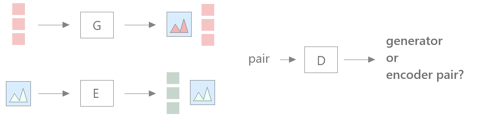

If I had to describe a Mondrian painting, I wouldn't remember its pixels. Instead, I would suggest the position of the lines and the color of the rectangles. Describing it pixel by pixel would be such a unnecessary task - we can simply take the most important features and save memory space in our brains.

In feature learning, we train machine learning models to extract meaningful features from data.  Given the complexity of natural images, this is not an easy task. Guaranteeing that the model won't focus on details such as hair and freckles in a face depends heavily on the function we are optimizing.
In autoencoders, for example, we minimize a pixelwise distance between the real and generated images. The model, therefore, captures minor details and doesn't prioritize the main content in images.

Generative Adversarial Networks (GANs), on the other hand, have the potential to learn semantic features, as shown in [Adversarial Feature Learning](https://arxiv.org/pdf/1605.09782.pdf) paper in 2017. In this paper, the authors added an encoder to the vanilla GAN, forcing the discriminator to distinguish generator and encoder image-features pairs. GANs offer the advantage of making no assumption about the structure or type of data to which they are applied, leading to a more sophiscated feature extraction.

## The model

The network comprises three submodels: a generator G, an encoder E and a Discriminator D.
The generator creates an image from a latent space, while the encoder learns how to invert G and project the images back into that space. The discriminator asserts if an image-feature pair comes from the generator or the encoder. 

The authors have also tested other tatics to extract features from the images, such as a latent regressor. This option, however, don't succeed as much as Bidirectional GAN when applied to complex datasets, such as ImageNet. They also point out that we can't use features from D.
If G and E converge, D is not able to distinguish their results and doesn't learn meaningful intermediate representations.

The original GAN loss function V is:

$$
 V(G,D) = \mathbb{E}_{x \sim p_X}[\log D(x)] + \mathbb{E}_{z \sim p_Z}[\log ( 1 - D(G(z)))]
$$

where x is an image input and z is the latent space vector, and \textit{p} their respective distributions. We can interpret V as a measure of D accuracy. We optimize G and D through an adversarial objective $\min_{G} \max_{D}$ V(G,D). 

The new bidirectional GAN loss proposed in the paper is:

$$
 V(G,E,D) = \mathbb{E}_{x \sim p_X}[\log D(x,E(x))] \\ + \mathbb{E}_{z \sim p_Z}[\log ( 1 - D(G(z), z))]
$$ 

Now, the discriminator receives two inputs, and the min max objective is 
$\min_{G,E} \max_{D}$ V(G, E, D).

## Results

The theoretical results were the most important contributions of the paper.
First, the authors proved that the convergence occurs simultaneously for the encoder and generator when one learns to invert the other ($E = G^{-1}$ almost everywhere). As from the paper:

> The BiGAN objective forces the encoder, in order to fool the discrimator at a particular z, to invert the generator at that z, such that E(G(z)) = z

The authors also presented interesting empirical results. The BiGAN features extracted from E(x) are useful for classification tasks, and overcome a latent regressor when applied to complex datasets. For the MNIST, both performed similarly. The unsupervised encoder learnt filters similar to the ones of supervised models on ImageNet, and generalized well to detection and segmentation tasks too.

## References

Donahue, J., Krähenbühl, P., & Darrell, T. (2016). Adversarial feature learning. arXiv preprint arXiv:1605.09782.

Goodfellow, I., Pouget-Abadie, J., Mirza, M., Xu, B., Warde-Farley, D., Ozair, S., ... & Bengio, Y. (2014). Generative adversarial nets. In Advances in neural information processing systems (pp. 2672-2680).